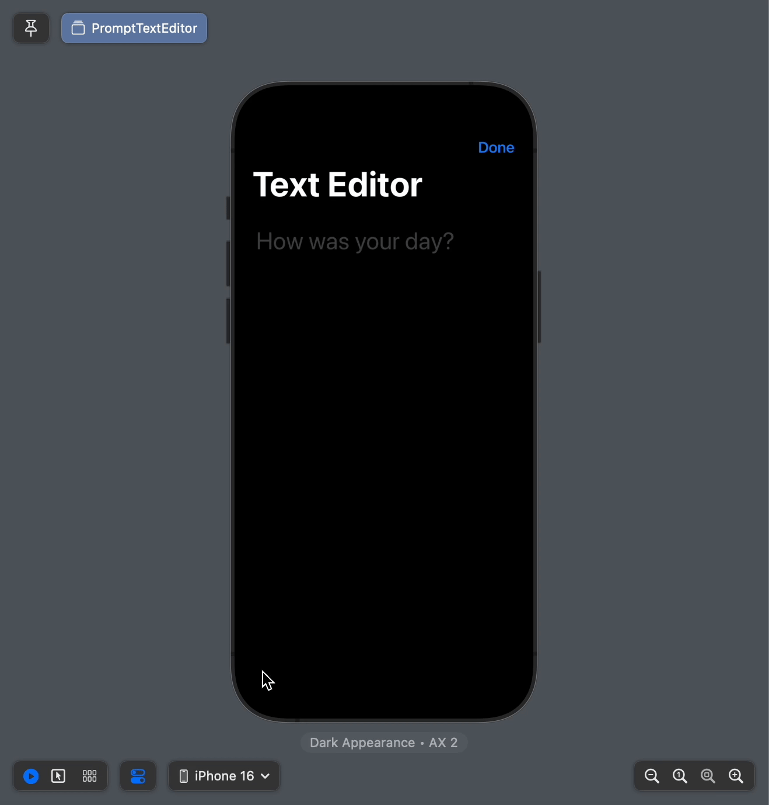
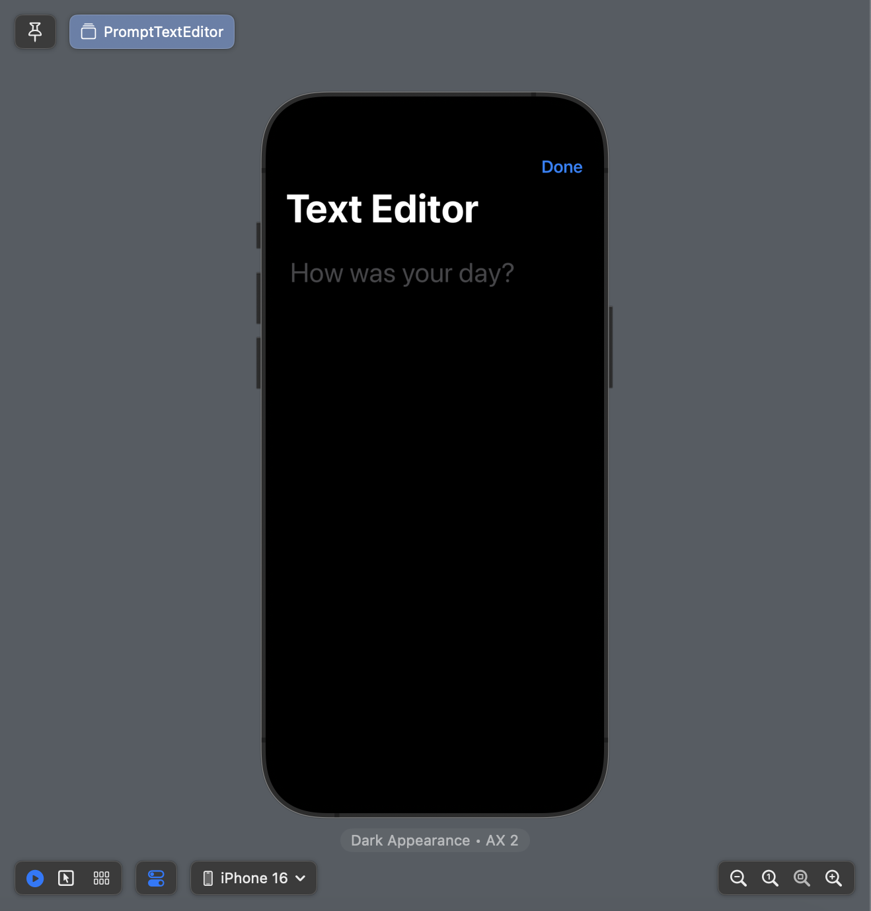
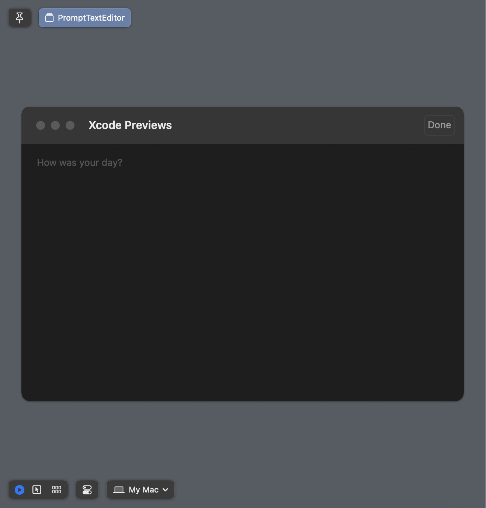
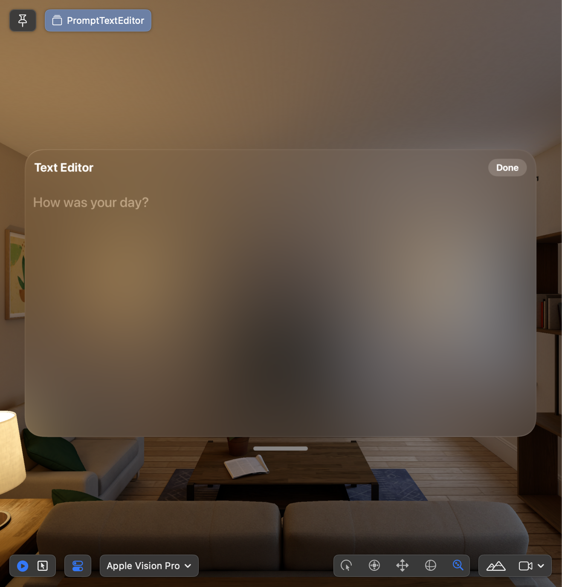

# PromptTextEditor

A SwiftUI view that can display and edit long-form text or display a prompt when the editor's content is empty.

## Features

- **Customizable UI**: Easily integrate and style the editor as same as `SwiftUI.TextEditor`
- **Cross-Platform**: Compatible with:
    - iOS 15.0+
    - macOS 12.0+.
    - visionOS 1.0+.
- **Swift Package Manager**: Simple integration via SPM.

## Demo






## Installation

Add `PromptTextEditor` to your project via Swift Package Manager:

1. Open Xcode and go to **File > Add Packages**.
2. Enter the URL of this repository:  
   ```
   https://github.com/tphduy/PromptTextEditor
   ```
3. Choose the latest version and add the package to your project.

## Basic Setup

To use `PromptTextEditor`, import the module and add the editor to your SwiftUI view. 

```swift
import PromptTextEditor

struct ContentView: View {
    @State private var text: String = ""

    var body: some View {
        PromptTextEditor(
            text: $text,
            prompt: Text("How was your day?")
        )
    }
}
```

## Customizing Prompts

You can provide custom prompt logic and adjust the appearance to suit your application's needs, as same as `SwiftUI.TextEditor`.

### Foreground Style

Starting from **iOS 17.0, macOS 14.0, and visionOS 1.0**, the `PromptTextEditor` applies the placeholder sematic style for `prompt`, For example, you can set the foreground style to `.pink` as below.

```swift
PromptTextEditor(
    text: $text,
    prompt: Text("How was your day?")
)
.foregroundStyle(.pink)
```


For older versions of these operating systems, the prompt will default to the third level of the current foreground style `.tertiary`.

### Multiline Text Alignment

Applying multiline text alignment will affect both the text and prompt:

```swift
PromptTextEditor(
    text: $text,
    prompt: Text("How was your day?")
)
.multilineTextAlignment(.center)
```


### Font

Applying font will affect both the text and prompt. The same behavior for line limit, line spacing, and so on.
```swift
PromptTextEditor(
    text: $text,
    prompt: Text("How was your day?")
)
.font(.system(size: 60))
```


## Contributing

Contributions are welcome! If you find a bug or have a feature request, feel free to open an issue or submit a pull request.

## License

`PromptTextEditor` is released under the MIT License. See the [LICENSE](./LICENSE) file for more information.
